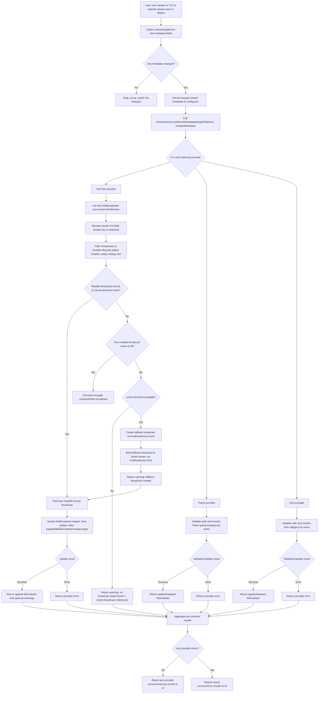

# Yet Another Streamer Helper (YASH)

> NOTICE: Contributions are temporarily paused. The repository author has disabled certain features (OS keyring and hybrid encryption). Pull requests will be reviewed but may be closed until the author re-opens contributions.

Small toolkit to manage streaming across YouTube, Twitch, and Kick with a
unified interface. Written to run on Bun. This repository contains:

- src/: TypeScript source (platform providers, services, UI)
- test/: Unit and integration tests (run with `bun test`)
- config.json: (local config) Not committed — use config.example.json as a template and create a local config.json with your secrets.

Quickstart

1. Install dependencies: `bun install`
2. Copy `config.example.json` to `config.json`
3. Run checks: `bun test` or `bun typecheck`
4. Launch the full app: `bun run start`

Runtime entrypoints
-------------------

- `bun run start` starts the current primary entrypoint: `src/index.tsx`
- `src/index.tsx` runs the TUI and imports `src/index.ts` as a side effect to start `Bun.serve` in the same process
- `bun run start:webui` runs only the web server (`src/index.ts`)
- `bun run start:tui` runs the TUI-focused mode (`YASH_TUI_ONLY=1 bun run src/index.tsx`)
- `Bun.serve` intentionally uses `development: false`; Bun development-mode bundle timing output corrupts the TUI rendering on the shared terminal fd

Important: running the TUI process and web server as separate long-lived processes against the same port is not the supported default flow anymore. Use `bun run start` unless you explicitly want a web-only or TUI-only mode.

Configuration
-------------
This project reads configuration from `config.json` in the repository root during local runs and tests. Do NOT commit secrets.

1. Copy `config.example.json` to `config.json` and update values that are local-only (obs websocket password, stream keys, etc.).
   - `cp config.example.json config.json`
2. Add `config.json` to `.gitignore` if it's not already ignored (this repository's .gitignore already includes `config.json`).

Security posture
----------------

This build uses file-backed local configuration and token storage. The following security features are intentionally out of scope in the current repository state:

- encryption at rest for platform tokens or local config
- OS keyring integration
- encryption-key rotation
- encrypted admin key export/import flows

Operationally, that means:

- `config.json` and the files under `~/.yash/` should be treated as sensitive local secrets
- this repository is suitable for local or otherwise controlled environments, not as-is for broad public multi-tenant deployment
- if you expose the web server beyond localhost, you should add a reverse proxy / network ACL layer and explicit authentication controls around any sensitive endpoints

Stream modal category autocomplete: the `/stream` modal (TUI) and stream form (WebUI) have per-platform category fields. Twitch and Kick fields autocomplete live as you type (300 ms debounce); YouTube uses a static dropdown. All three are sent as separate metadata fields (`twitchGame`, `kickCategory`, `youtubeCategory`).

YouTube `/stream` targeting notes:

- `/stream` may only update mutable YouTube broadcasts: `created`, `ready`, `testing`, or `live`
- Completed or revoked broadcasts are never valid update targets
- If no mutable broadcast exists for the configured stream key, YASH creates a fallback broadcast with `liveBroadcasts.insert`, binds it with `liveBroadcasts.bind`, and then applies the metadata update to that new broadcast
- Studio can create an unscheduled `ready` "Direct stream" broadcast with `snippet.scheduledStartTime = null`
- The public YouTube API does not expose that exact creation behavior: `liveBroadcasts.insert` requires a future `scheduledStartTime`, and using Unix epoch zero is rejected with `invalidScheduledStartTime`

/stream validation and execution flow
------------------------------------



Notes:
- YouTube completed/revoked broadcasts are never valid `/stream` update targets.
- If YouTube has no mutable target, YASH may create a fallback broadcast and bind it to the saved stream key before applying metadata.
- The public YouTube API does not reproduce Studio's unscheduled direct-stream sentinel exactly; fallback creation may briefly exist as an upcoming broadcast because `liveBroadcasts.insert` requires a future `scheduledStartTime`.

OBS Reconnection & Backoff
--------------------------
You can tune the OBS websocket reconnection and backoff behaviour via environment variables or `config.json` (under `obs.websocket`). Environment variables take precedence and are useful for CI/runtime overrides.

Environment variables (examples & defaults):

- `YASH_OBS_SERVER` — OBS websocket host (eg. `localhost`)
- `YASH_OBS_PORT` — OBS websocket port (eg. `4455`)
- `YASH_OBS_PASSWORD` — OBS websocket password
- `YASH_OBS_RECONNECT_BASE_MS` — base backoff delay in ms (default: `30000`)
- `YASH_OBS_RECONNECT_MAX_MS` — maximum backoff cap in ms (default: `300000` / 5min)
- `YASH_OBS_RECONNECT_MULTIPLIER` — exponential multiplier (default: `2`)
- `YASH_OBS_RECONNECT_MAX_ATTEMPTS` — maximum retry attempts (default: unlimited)
- `YASH_OBS_CONNECT_DELAY_MS` — simulated connect delay in ms (used for testing, default: `1000`)

Example (env):

```
export YASH_OBS_RECONNECT_BASE_MS=10000
export YASH_OBS_RECONNECT_MULTIPLIER=2
export YASH_OBS_RECONNECT_MAX_ATTEMPTS=10
```

Or in `config.json`:

```
{
  "obs": {
    "websocket": {
      "server": "localhost",
      "port": "4455",
      "reconnectBaseMs": 10000,
      "reconnectMultiplier": 2,
      "reconnectMaxAttempts": 10
    }
  }
}
```

Notes: values supplied via environment variables are parsed as strings and cast to numbers by the app where applicable.

CI and secrets
--------------
- For CI, provide secrets via environment variables or a secrets manager (do not commit config.json with credentials).
- There is also a gitleaks GitHub Action to scan history and PRs for secrets. Review gitleaks results in CI and tune if required.
- CI secret injection reduces accidental commits; it does not change the runtime fact that YASH persists tokens/config to local files in this build.

Notes:
- Use `bun run start` as the default local development entrypoint.
- `src/main.tsx` is the browser-side dashboard entry imported by `index.html`; it is not the TUI process entrypoint.

See SPECS.md for architecture and conventions.


Kick Webhook Relay
------------------
When the Kick platform provider calls `setupWebhooks()`, the app starts a smee.io relay channel and logs the public relay URL to the console. Register that URL in your Kick developer app settings (under "Webhook URL") so Kick can deliver real-time chat events to your local instance.

The relay URL is also available at runtime via `GET /api/kick/webhook` (returns `{ url: string | null }`), and the `unified` web view displays it with a copy button for convenience.

Metrics & Prometheus
--------------------
This project exposes lightweight in-memory metrics for CI and local debugging.

- JSON snapshot: GET /api/metrics returns counters, gauges, and timestamps as JSON.
- Prometheus exposition: GET /metrics returns the same metrics in Prometheus text format
  (Content-Type: text/plain; version=0.0.4). This endpoint is intended for scraping by
  CI or lightweight Prometheus setups where data sensitivity is not a concern.

Keys currently exported (examples)
- obs.reconnect.failures (counter)
- obs.reconnect.attempts (counter)
- obs.reconnect.lastAttemptTs (timestamp, ms)
- obs.reconnect.exhausted (counter)
- obs.reconnect.exhaustedTs (timestamp, ms)

Prometheus naming conventions
---------------------------
When exported to Prometheus format (/metrics), metric names are sanitized and follow these conventions:
- Counters are exported as <sanitized_name>_total (Prometheus counter convention).
- Gauges are exported as <sanitized_name>.
- Timestamps are exported as <sanitized_name>_timestamp_seconds (gauge, seconds since epoch).

Example: counter obs.reconnect.failures -> obs_reconnect_failures_total

Security note: /api/metrics and /metrics are unauthenticated by default. If you plan to
expose them on a public network, add an ACL or authentication layer before enabling scraping.

Practical recommendation:

- leave metrics bound to localhost or an internal network by default
- if you need remote scraping, set `YASH_METRICS_TOKEN` and still prefer a reverse proxy / firewall boundary

Optional authentication
-----------------------
If you want to protect the metrics endpoints, set an environment variable `YASH_METRICS_TOKEN`.
When set, both `/api/metrics` (JSON) and `/metrics` (Prometheus text) will require this token.

Accepted authentication methods:
- HTTP header: `Authorization: Bearer <token>`
- HTTP header: `x-api-key: <token>`
- Query parameter: `?token=<token>`

Example (env):

```
export YASH_METRICS_TOKEN=supersecret-token
```

Then access metrics with a header:

```
curl -H "Authorization: Bearer supersecret-token" http://localhost:3000/metrics
```

Using The Prebuilt Hermetic Docker Image
---------------------------------------

We publish a hermetic Docker image that contains Bun, Node (for Playwright tooling), and preinstalled Playwright browsers. The image name is:

```
ghcr.io/<OWNER>/<REPO>/yash-ci:latest
```

Replace `<OWNER>/<REPO>` with your GitHub repository path (the publish workflow tags the image as `ghcr.io/${{ github.repository }}/yash-ci:latest` and `:${{ github.sha }}`).

Quick examples:

- Pull the image:

```
docker pull ghcr.io/<OWNER>/<REPO>/yash-ci:latest
```

- Run the server from the image (mounts the repo `tmp/` to `/app/tmp` inside the container so artifacts can be collected):

```
mkdir -p tmp
docker run --rm -p 3000:3000 -v "$(pwd)/tmp:/app/tmp" --user "$(id -u):$(id -g)" ghcr.io/<OWNER>/<REPO>/yash-ci:latest /bin/bash -lc 'bun run start:webui'
```

- CI / hermetic invocation (example taken from the repository CI):

```
docker run --rm -e RUN_PLAYWRIGHT=1 -v "${{ github.workspace }}/tmp:/app/tmp" --user "$(id -u):$(id -g)" ghcr.io/<OWNER>/<REPO>/yash-ci:latest /bin/bash -lc '
  bun run start:webui &
  for i in $(seq 1 60); do
    curl -sSf http://localhost:3000/api/status -o /dev/null && break || sleep 1
  done
  # run tests inside the image as needed (Playwright / bun test)
'
```

Notes:
- The CI workflows in `.github/workflows/` already reference this image name. If you mirror or rename the image, update the workflows accordingly.
- The `--user "$(id -u):$(id -g)"` flag ensures files written into the mounted `tmp/` directory are owned by the host runner user so the Actions upload step can read them.

Building the hermetic image with host UID/GID baked in
-----------------------------------------------------

In some CI setups it's helpful to bake a host-matching user into the image at build time so files created by processes in the container already have the correct UID/GID on the host. The Dockerfile supports build args `HOST_UID` and `HOST_GID` for this purpose.

Example:

```
docker build --build-arg HOST_UID=$(id -u) --build-arg HOST_GID=$(id -g) -t yash-ci:local .
```
