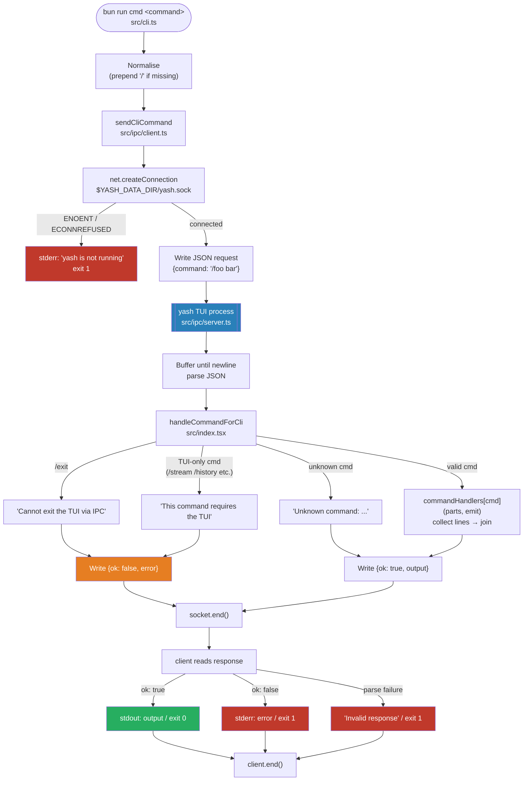
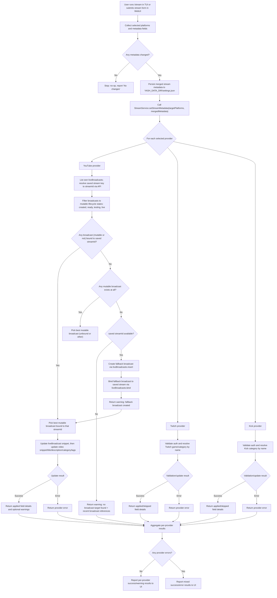

# Yet Another Streamer Helper (YASH)

Disclaimer : I used to stream on Windows with some scripts but when I stared to stream on Linux, it was painful to make Streamer.Bot even works normally that it gave me the idea to replace it with some app on linux. After some failed configuration to run my custom scripts (bash/powershell/typescript within wine) and some AI tests, I decided to give it a shot directly with an app seeing that the Kick api was finally available (it was my last blocker for some tries already on Windows....)

Small toolkit to manage streaming across YouTube, Twitch, and Kick with a unified interface. Written to run on Bun. This repository contains:

- `src/`: TypeScript source (platform providers, services, UI)
- `test/`: Unit and integration tests (run with `bun test`)
- `config.example.json`: Template for bootstrap config stored at `YASH_DATA_DIR/config.json`
- `settings.example.json`: Template for mutable runtime settings stored at `YASH_DATA_DIR/settings.json`

## Quickstart

1. Install dependencies: `bun install`
2. Launch the full app: `bun run start`

## Runtime entrypoints

- `bun run start` starts the current primary entrypoint: `src/index.tsx`
- `src/index.tsx` runs the TUI and imports `src/index.ts` as a side effect to start `Bun.serve` in the same process
- `bun run start:webui` runs only the web server (`src/index.ts`)
- `bun run start:tui` runs the TUI-focused mode (`YASH_TUI_ONLY=1 bun run src/index.tsx`)
- `bun run cmd <command>` sends a command to a running TUI process via IPC (see [CLI IPC](#cli-ipc) below)
- `Bun.serve` intentionally uses `development: false`; Bun development-mode bundle timing output corrupts the TUI rendering on the shared terminal fd

> **Note:** Running the TUI process and web server as separate long-lived processes against the same port is not the supported default flow anymore. Use `bun run start` unless you explicitly want a web-only or TUI-only mode.

## CLI IPC

When a TUI process is running, it listens on a Unix Domain Socket at `YASH_DATA_DIR/yash.sock` (default `~/.config/yash/yash.sock`). The `bun run cmd` script connects to that socket, sends a command, prints the response, and exits.

```sh
bun run cmd /action          # list public IPC-safe actions
bun run cmd /marker          # drop a stream marker
bun run cmd /marker "Replay | -300"  # 5 minutes before the current live position
bun run cmd /marker "Boss | 32:44"   # 32 minutes 44 seconds from stream start
bun run cmd /markers         # list all markers
bun run cmd /markers restore twitch
bun run cmd /settings get stream.title
bun run cmd /settings set demo true
bun run cmd /connect youtube
bun run cmd /msg all Hello chat
bun run cmd /help
```

Both forms are accepted — `bun run cmd marker` and `bun run cmd /marker` are equivalent; the leading `/` is added automatically if omitted.

`/marker` accepts raw seconds as before, and also `mm:ss` or `hh:mm:ss` timestamps for YouTube chapters.

`/markers restore twitch [limit]` imports recent Twitch markers into persisted YouTube chapters, but only when that marker text is missing from YouTube already. Persisted YouTube chapters stay sorted by timestamp so `/markers`, edit, and clear IDs remain stable after imports.

Commands invoked over IPC are also echoed into the live TUI chat pane before their output, using an `[ipc → cmd] /...` line. The same command echo exists for typed slash commands inside the TUI as `[you → cmd] /...`.

**Exit behaviour:**
- Exits `0` with stdout output on success
- Exits `1` and prints the error string to stderr on command error
- Exits `1` and prints `yash is not running` when the socket is absent or the connection is refused

**Commands blocked over IPC** (return an error string instead of executing):

| Command | Reason |
|---|---|
| `/exit` | Cannot terminate the TUI remotely |
| `/stream` | Requires TUI modal interaction |
| `/setup-youtube` | Requires TUI modal interaction |
| `/history` | Requires TUI modal interaction |
| `/activity` | Requires TUI modal interaction |
| `/chatter` | Requires TUI modal interaction |
| `/inject` | TUI-only dev/testing helper |
| `/settings` (bare) | Requires TUI settings modal |

`/settings get <key>` and `/settings set <key> <value>` work normally over IPC.

### `/action` command

`/action` exposes public IPC-safe actions from the internal action registry.

```sh
bun run cmd /action
bun run cmd /action marker.create timestamp=-300
bun run cmd /action obs.shutdown.initiate
bun run cmd /action obs.shutdown.initiate delay=10 scene='[PS] End'
```

- `/action` with no action id lists public actions grouped by domain
- `/action <id>` invokes the action directly when all args are optional
- `/action <id>` shows help and examples when required args are still missing
- `/action <id> key=value ...` parses typed args and invokes the action

The TUI autocomplete also understands `/action`, including action ids, `key=` argument names, and enum values.

**Stale socket cleanup:** the server removes any pre-existing socket file at startup, so a leftover socket from a crash does not block a new TUI launch.

### IPC round-trip flow



## Configuration

This project splits runtime state across two files under `YASH_DATA_DIR` (default `~/.config/yash`). Do NOT commit either file.

On startup, YASH performs a one-time migration from the legacy repository-root `config.json` when that legacy file exists and the runtime config file does not yet exist. It also performs a one-time split migration that moves mutable runtime settings out of `config.json` into `settings.json`.

1. Copy `config.example.json` to your runtime config location and update bootstrap values that are local-only (OBS websocket password, provider credentials, stream keys, etc.).
   ```
   mkdir -p "${YASH_DATA_DIR:-${XDG_CONFIG_HOME:-$HOME/.config}/yash}" && cp config.example.json "${YASH_DATA_DIR:-${XDG_CONFIG_HOME:-$HOME/.config}/yash}/config.json"
   ```
2. Copy `settings.example.json` to your runtime settings location and update mutable defaults such as stream metadata, UI preferences, and YouTube setup flags.
   ```
   mkdir -p "${YASH_DATA_DIR:-${XDG_CONFIG_HOME:-$HOME/.config}/yash}" && cp settings.example.json "${YASH_DATA_DIR:-${XDG_CONFIG_HOME:-$HOME/.config}/yash}/settings.json"
   ```
3. If you already have a legacy repo-root `config.json`, YASH will migrate it once automatically the first time it starts without an existing runtime config file.

`config.json` holds rarely edited bootstrap data such as OBS, server, and provider credentials/setup fields. `settings.json` holds mutable runtime state such as `stream.*`, `platforms.youtube.setup`, chat/UI preferences, demo mode, and per-platform viewer display settings.

## Script configuration

Bundled and user scripts read JSONC config from `~/.config/yash/scripts/<scriptId>/config.jsonc`.

For example, the bundled `obs-shutdown` action can be configured at:

```jsonc
// ~/.config/yash/scripts/obs-shutdown/config.jsonc
{
  "delay": 10,
  "chatInterval": 10,
  "stopStream": true,
  "scene": "[PS] End",
  "message": "Stream ending in {remaining}s!",
  "source": "[TXT] Countdown",
  "sourceText": "{remaining}s"
}
```

That lets `/action obs.shutdown.initiate` run with config-backed defaults, optionally keep an OBS text source updated during the countdown, and choose whether the countdown should actually stop the OBS stream when it reaches zero.

## Security

- `YASH_DATA_DIR/config.json`, `YASH_DATA_DIR/settings.json`, and the other files under `YASH_DATA_DIR` (default `~/.config/yash/`) should be treated as sensitive local secrets
- This repository is suitable for local or otherwise controlled environments, not as-is for broad public multi-tenant deployment
- If you expose the web server beyond localhost, you should add a reverse proxy / network ACL layer and explicit authentication controls around any sensitive endpoints

## Stream category autocomplete

The `/stream` modal (TUI) and stream form (WebUI) have per-platform category fields. Twitch and Kick fields autocomplete live as you type (300 ms debounce); YouTube uses a static dropdown. All three are sent as separate metadata fields (`twitchGame`, `kickCategory`, `youtubeCategory`).

## YouTube `/stream` targeting notes

- `/stream` may only update mutable YouTube broadcasts: `created`, `ready`, `testing`, or `live`
- Completed or revoked broadcasts are never valid update targets
- If no mutable broadcast exists for the configured stream key, YASH creates a fallback broadcast with `liveBroadcasts.insert`, binds it with `liveBroadcasts.bind`, and then applies the metadata update to that new broadcast
- Studio can create an unscheduled `ready` "Direct stream" broadcast with `snippet.scheduledStartTime = null`
- The public YouTube API does not expose that exact creation behavior: `liveBroadcasts.insert` requires a future `scheduledStartTime`, and using Unix epoch zero is rejected with `invalidScheduledStartTime`

## `/stream` validation and execution flow



**Notes:**
- YouTube completed/revoked broadcasts are never valid `/stream` update targets.
- If YouTube has no mutable target, YASH may create a fallback broadcast and bind it to the saved stream key before applying metadata.
- The public YouTube API does not reproduce Studio's unscheduled direct-stream sentinel exactly; fallback creation may briefly exist as an upcoming broadcast because `liveBroadcasts.insert` requires a future `scheduledStartTime`.

## OBS reconnection & backoff

YASH keeps retrying OBS websocket connections both after an established connection drops and when OBS was unavailable during app startup. You can tune that reconnection and backoff behaviour via environment variables or the runtime config file at `YASH_DATA_DIR/config.json` (default `~/.config/yash/config.json`, under `obs.websocket`). Environment variables take precedence and are useful for CI/runtime overrides.

**Environment variables:**

| Variable | Description | Default |
|---|---|---|
| `YASH_OBS_SERVER` | OBS websocket host | `localhost` |
| `YASH_OBS_PORT` | OBS websocket port | `4455` |
| `YASH_OBS_PASSWORD` | OBS websocket password | — |
| `YASH_OBS_RECONNECT_BASE_MS` | Base backoff delay in ms | `30000` |
| `YASH_OBS_RECONNECT_MAX_MS` | Maximum backoff cap in ms | `300000` (5 min) |
| `YASH_OBS_RECONNECT_MULTIPLIER` | Exponential multiplier | `2` |
| `YASH_OBS_RECONNECT_MAX_ATTEMPTS` | Maximum retry attempts | unlimited |
| `YASH_OBS_CONNECT_DELAY_MS` | Simulated connect delay in ms (testing) | `1000` |

**Example (env):**

```sh
export YASH_OBS_RECONNECT_BASE_MS=10000
export YASH_OBS_RECONNECT_MULTIPLIER=2
export YASH_OBS_RECONNECT_MAX_ATTEMPTS=10
```

**Example (`~/.config/yash/config.json`):**

```json
{
  "obs": {
    "websocket": {
      "server": "localhost",
      "port": "4455",
      "reconnectBaseMs": 10000,
      "reconnectMultiplier": 2,
      "reconnectMaxAttempts": 10
    }
  }
}
```

> **Note:** Values supplied via environment variables are parsed as strings and cast to numbers by the app where applicable.

## Kick webhook relay

When the Kick platform provider calls `setupWebhooks()`, the app starts a smee.io relay channel and logs the public relay URL to the console. Register that URL in your Kick developer app settings (under "Webhook URL") so Kick can deliver real-time chat events to your local instance.

The relay URL is also available at runtime via `GET /api/kick/webhook` (returns `{ url: string | null }`).
